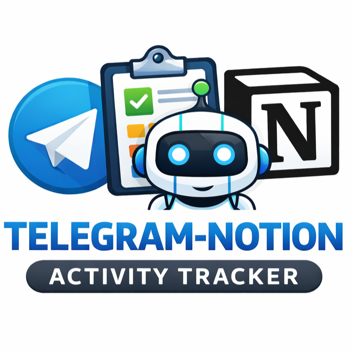

<!-- Encabezado -->
[![Colaboradores][contributors-shield]][contributors-url]
[![Forks][forks-shield]][forks-url]
[![Estrellas][stars-shield]][stars-url]
[![Issues][issues-shield]][issues-url]
[![MIT License][license-shield]][license-url]

<!-- Título -->
<br />
<div align="center">

<h1 align="center">telegram-notion-activity-tracker</h1>
  <p align="center">
    Registro automático de actividades vía Telegram, con clasificación por IA y almacenamiento en Notion.
    <br />
    
    <br />
    <a href="https://github.com/andres-merino/telegram-notion-activity-tracker/issues">Reportar un Problema</a>
  </p>
</div>

<!-- Cuerpo -->
## Sobre el Proyecto

Este proyecto permite registrar actividades de forma rápida mediante Telegram (texto o audio), clasificarlas automáticamente usando IA según una taxonomía definida, y almacenarlas de forma estructurada en una base de datos de Notion.

El objetivo es construir un historial organizado de actividades que facilite el análisis, seguimiento y generación automática de informes de gestión al cierre de un periodo.

El sistema realiza:

- Recepción de mensajes o audios desde Telegram
- Transcripción automática (si el mensaje es audio)
- Clasificación inteligente de la actividad
- Estructuración de datos
- Registro automático en Notion

### Construido con

 
 


## Descripción

El sistema permite enviar un mensaje o nota de voz describiendo una actividad realizada. La IA analiza el contenido, identifica su naturaleza y la clasifica según una estructura definida.

La información registrada en Notion incluye:

- Fecha
- Nombre de la actividad
- Descripción de la actividad
- Categoría

## Contenido del Repositorio

- `activity_tracker.ipynb`: Notebook interactivo para pruebas.
- `bot_uploader.py`:  Bot de Telegram para recibir mensajes y audios con el registro de actividades.
- `classifier.py`:  Lógica de clasificación de actividades basada en IA y taxonomía definida.
- `transcriber.py`:  Transcripción de mensajes de voz a texto.
- `categories.json`:  Definición de categorías para clasificación de actividades.
- `notion_client.py`:  Funciones para interactuar con la API de Notion y registrar actividades.

## Configuración

Crea un archivo llamado `.env` en la raíz del proyecto con el siguiente contenido:

```env
OPENAI_API_KEY = ...      # Tu clave API de OpenAI
NOTION_TOKEN = ...        # Token de integración de Notion
NOTION_DATABASE_ID = ...  # ID de la base de datos de Notion
TELEGRAM_TOKEN = ...      # Token del bot de Telegram
USUARIO_AUTORIZADO = ...  # Tu ID personal de Telegram
```

## Uso

Crea un bot privado, configura tu `BOT_TOKEN` y tu `USUARIO_AUTORIZADO` en el archivo `.env`, y ejecuta:

```bash
python bot_uploader.py
```

Envía un mensaje o audio al bot describiendo una actividad.  
El sistema procesará automáticamente y la registrará en Notion.


## Créditos

**Andrés Merino**  
Docente-Investigador — Pontificia Universidad Católica del Ecuador  

[![LinkedIn][linkedin-shield]][linkedin-url-aemt]

## Licencia

Distribuido bajo la licencia MIT.

[![MIT License][license-shield]][license-url]

<!-- MARKDOWN LINKS & IMAGES -->

[contributors-shield]: https://img.shields.io/github/contributors/andres-merino/telegram-notion-activity-tracker.svg?style=for-the-badge
[contributors-url]: https://github.com/andres-merino/telegram-notion-activity-tracker/graphs/contributors
[forks-shield]: https://img.shields.io/github/forks/andres-merino/telegram-notion-activity-tracker.svg?style=for-the-badge
[forks-url]: https://github.com/andres-merino/telegram-notion-activity-tracker/forks
[stars-shield]: https://img.shields.io/github/stars/andres-merino/telegram-notion-activity-tracker?style=for-the-badge
[stars-url]: https://github.com/andres-merino/telegram-notion-activity-tracker/stargazers
[issues-shield]: https://img.shields.io/github/issues/andres-merino/telegram-notion-activity-tracker.svg?style=for-the-badge
[issues-url]: https://github.com/andres-merino/telegram-notion-activity-tracker/issues
[license-shield]: https://img.shields.io/github/license/andres-merino/telegram-notion-activity-tracker.svg?style=for-the-badge
[license-url]: https://es.wikipedia.org/wiki/Licencia_MIT
[linkedin-shield]: https://img.shields.io/badge/linkedin-%230077B5.svg?style=for-the-badge&logo=linkedin&logoColor=white
[linkedin-url-aemt]: https://www.linkedin.com/in/andrés-merino-010a9b12b/
